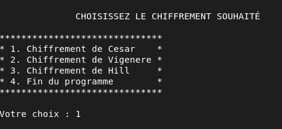
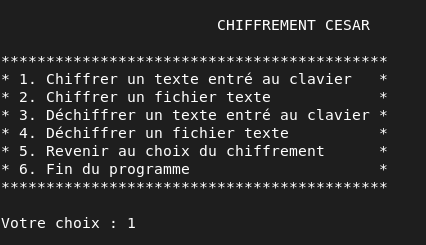
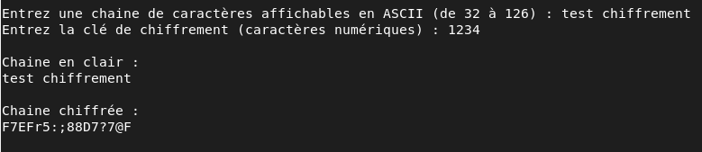
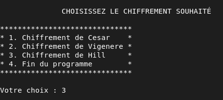
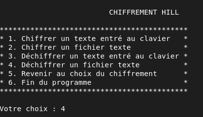
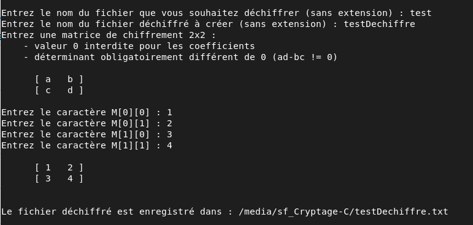

# Chiffrement de messages

Ce projet a pour but de découvrir les bases de la cryptographie, que l'on peut définir comme une technique d'écriture où un message chiffré est écrit à l'aide de codes secrets ou de clés de chiffrement. Nous avons implémenté trois méthodes différentes : le chiffrement de César, le chiffrement de Vigenère ainsi que le chiffrement de Hill. Pour ces trois techniques de chiffrement, vous aurez le choix entre chiffrer une chaine entrée au clavier, la déchiffrer, chiffrer un fichier texte ainsi que le déchiffrer. Nous avons aussi décidé de chiffrer les caractères à l'aide de la table ASCII, plus particulièrement les caractères dit 'affichables' (code ASCII de 32 à 126). Par la suite nous appelerons caractères non affichables/interdits tous les caractères ne faisant pas partie de cet ensemble.

## Installation

Si git est installé sur votre apareil :
```bash
  git clone https://github.com/Arthur-Bourgoin/Cryptage-C.git
```


Dans un terminal sous linux :
```bash
  wget https://github.com/Arthur-Bourgoin/Cryptage-C/archive/refs/heads/main.zip
```
    
## Démarrage

Pour compiler le projet :
```bash
  make all
```

Pour éxécuter le projet :
```bash
  ./main
```

Pour débogger les erreurs d'utilisation de la mémoire :
```bash
  valgrind ./main
```
Si vous n'avez pas les droits pour éxécuter le fichier main (sous linux) :
```bash
  su -
  chmod 555 main
```

## Règles

1- Seul les carcatères ASCII de 32 à 127 sont autorisés (126 pour Hill).  

2- Seul les fichiers textes peuvent être chiffrés, si l'extension de votre fichier n'est pas .txt, vous obtiendrez une erreur.  

3- La matrice du chiffrement de Hill ne peut pas avoir un déterminant égal à 0.  

4- Si vous décryptez une chaine avec un nombre de caractères impair (ce qui ne vous arrivera normalement pas) avec le chiffrement de Hill, les deux derniers caractères ne seront pas déchiffrés correctement.
## Demo

### Chiffrement d'une chaine (César)

1- Choix du chiffrement  


2- Choix de l'action à réaliser  


3- Entrée de la chaine à chiffrée et affichage  



### Déchiffrement d'un fichier texte (Hill)

1- Choix du chiffrement  


2- Choix de l'action à réaliser  


3- Entrée de la matrice de chiffrement  



## Description des fonctions

### Cesar.c

Le chiffrement de César est un chiffrement par substitution monoalphabétique, où chaque lettre est remplacée par une autre lettre se situant un peu plus loin dans l'alphabet (donc décalée mais toujours identique pour un même message).

#### char* chiffrerCesar(char* chaine, int cle)
* Chiffre une chaine avec le chiffrement de César
* Paramètres :
  * chaine : la chaine à chiffrer
  * cle : la clé de chiffrement
 * Retour : 
   * La chaine chiffrée
   * NULL en cas d'erreur

#### char chiffrerCharCesar(char c, int cle)
* Chiffre un caractère avec le chiffrement de César
* Paramètres :
  * c : le caractère à chiffrer
  * cle : la clé de chiffrement
* Retour :
  * Le caractère chiffré

#### char* dechiffrerCesar(char* chaine, int cle)
* Déchiffre une chaine avec le chiffrement de César
* Paramètres :
  * chaine : la chaine à déchiffrer
  * cle : la clé de chiffrement
* Retour :
  * La chaine déchiffrée
  * NULL en cas d'erreur

#### char dechiffrerCharCesar(char c, int cle)
* Déchiffre un carctère avec le chiffrement de César
* Paramètres :
  * c : le caractère à déchiffrer
  * cle : la clé de chiffrement
* Retour :
  * Le caractère déchiffré

#### int adapterCleCesar(int cle)
* Réduit une clé modulo 128
* Paramètre :
  * cle : la clé de chiffrement
* Retour :
  * La clé réduite modulo 128

#### int chiffrerFichierCesar()
* Chiffre un fichier à l'aide du chiffrement de César
* Paramètre : ∅
* Retour :
  * 0  : Erreur lors de l'entrée de la clé de chiffrement
  * -1 : Erreur lors de l'ouverture du fichier en clair (lecture)
  * -2 : Erreur lors de l'ouverture du fichier chiffré (écriture)
  * -3 : Erreur lors du chiffrement d'une ligne
  * 1  : Succès du chiffrement

#### int chiffrerLigneFichierCesar(char* chaine, FILE* fic, int cle, int numLigne)
* Chiffre une ligne d'un fichier
* Paramètres :
  * chaine : La chaine à chiffrer
  * fic : Le fichier qui contiendra la chaine chiffrée
  * cle : La clé de chiffrement
  * numLigne : Le numéro de la ligne dans le fichier
* Retour :
  * -1 : La chaine contient des caractères interdits
  * 0  : Le chiffrement de la chaine a échoué
  * 1  : Succès du chiffrement

#### int dechiffrerFichierCesar()
* Déchiffre un fichier avec le chiffrement de César
* Paramètres : ∅
* Retour :
  * 0 : Erreur lors de l'entrée de la clé de chiffrement
  * -1 : Erreur lors de l'ouverture du fichier chiffré (lecture)
  * -2 : Erreur lors de l'ouverture du fichier en clair (écriture)
  * -3 : Erreur lors du déchiffrement d'une ligne
  * 1  : Succès du déchiffrement

#### int dechiffrerLigneFichierCesar(char* chaine, FILE* fic, int cle, int numLigne)
* Déchiffre une ligne d'un fichier
* Paramètres :
  * chaine : La chaine à déchiffrer
  * fic : Le fichier qui contiendra la chaine déchiffrée
  * cle : La clé de chiffrement
  * numLigne : Le numéro de la ligne dans le fichier
* Retour :
  * -1 : La chaine contient des caractères interdits
  * 0  : Le déchiffrement de la chaine a échoué
  * 1  : Succès du déchiffrement

#### int chiffrerEntreeCesar()
* Chiffre et affiche une chaine entrée par l'utilisateur
* Paramètre : ∅
* Retour :
  * -2 : Erreur lors de l'entrée de la chaine
  * -1 : Erreur lors de l'entrée de la clé de chiffrement
  * 0  : Erreur lors du chiffrement de la chaine
  * 1  : Succès du chiffrement

#### int dechiffrerEntreeCesar()
* Déchiffre et affiche une chaine entrée par l'utilisateur
* Paramètre : ∅
* Retour :
  * -2 : Erreur lors de l'entrée de la chaine
  * -1 : Erreur lors de l'entrée de la clé de chiffrement
  * 0  : Erreur lors du déchiffrement de la chaine
  * 1  : Succès du déchiffrement

#### int entrerCleCesar(char** entreeCle, int* cle)
* Demande et stocke une clé de chiffrement au format César
* Paramètres :
  * entreeCle : Contient la clé entrée par l'utilisateur au format char*
  * cle : Contient la clé entrée par l'utilisateur au format int
* Retour :
  * -1 : Erreur getline()
  * 0  : Le format de la clé n'est pas valide
  * 1  : Clé stockée avec succès

### Vigenere.c

Le chiffre de Vigenère est un algorithme de chiffrement polyalphabétique inventé par le cryptologue français Blaise de Vigenère au XVIe siècle. Il est basé sur un chiffrement par décalage auquel est ajouté l'utilisation d'un mot-clé qui modifie le décalage à chaque étape.

#### char* chiffrerVigenere(char* chaine, char* cle)
* Chiffre une chaine avec le chiffrement de Vigenère
* Paramètres :
  * chaine : la chaine à chiffrer
  * cle : la clé de chiffrement
 * Retour : 
   * La chaine chiffrée
   * NULL en cas d'erreur

#### char chiffrerCharVigenere(char c, int cle)
* Chiffre un caractère avec le chiffrement de Vigenère
* Paramètres :
  * c : le caractère à chiffrer
  * cle : la clé de chiffrement
* Retour :
  * Le caractère chiffré

#### char* dechiffrerVigenere(char* chaine, char* cle)
* Déchiffre une chaine avec le chiffrement de Vigenère
* Paramètres :
  * chaine : la chaine à déchiffrer
  * cle : la clé de chiffrement
* Retour :
  * La chaine déchiffrée
  * NULL en cas d'erreur

#### char dechiffrerCharVigenere(char c, int cle)
* Déchiffre un caractère avec le chiffrement de Vigenère
* Paramètres :
  * c : le caractère à déchiffrer
  * cle : la clé de chiffrement
* Retour :
  * Le caractère déchiffré

#### char* adapterCleVigenere(int size, char* key)
* Adapte le nombre de caractère de la clé pour qu'il corresponde à 'size'
* Paramètres :
  * size : Le nombre de caractères de la clé adaptée
  * key : la clé de chiffrement à adapterCleCesar
* Retour :
  * La nouvelle clé de chiffrement
  * NULL en cas d'erreur

#### int chiffrerFichierVigenere()
* Chiffre un fichier à l'aide du chiffrement de Vigenère
* Paramètre : ∅
* Retour :
  * 0  : Erreur lors de l'entrée de la clé de chiffrement
  * -1 : Erreur lors de l'ouverture du fichier en clair (lecture)
  * -2 : Erreur lors de l'ouverture du fichier chiffré (écriture)
  * -3 : Erreur lors du chiffrement d'une ligne
  * 1  : Succès du chiffrement

#### int chiffrerLigneFichierVigenere(char* chaine, FILE* fic, char* cle, int numLigne)
* Chiffre une ligne d'un fichier
* Paramètres :
  * chaine : La chaine à chiffrer
  * fic : Le fichier qui contiendra la chaine chiffrée
  * cle : La clé de chiffrement
  * numLigne : Le numéro de la ligne dans le fichier
* Retour :
  * -1 : La chaine contient des caractères interdits
  * 0  : Le chiffrement de la chaine a échoué
  * 1  : Succès du chiffrement

#### int dechiffrerFichierVigenere()
* Déchiffre un fichier avec le chiffrement de Vigenère
* Paramètres : ∅
* Retour :
  * 0  : Erreur lors de l'entrée de la clé de chiffrement
  * -1 : Erreur lors de l'ouverture du fichier chiffré (lecture)
  * -2 : Erreur lors de l'ouverture du fichier en clair (écriture)
  * -3 : Erreur lors du déchiffrement d'une ligne
  * 1  : Succès du déchiffrement

#### int dechiffrerLigneFichierVigenere(char* chaine, FILE* fic, char* cle, int numLigne)
* Déchiffre une ligne d'un fichier
* Paramètres :
  * chaine : La chaine à déchiffrer
  * fic : Le fichier qui contiendra la chaine déchiffrée
  * cle : La clé de chiffrement
  * numLigne : Le numéro de la ligne dans le fichier
* Retour :
  * -1 : La chaine contient des caractères interdits
  * 0  : Le déchiffrement de la chaine a échoué
  * 1  : Succès du déchiffrement

#### int chiffrerEntreeVigenere()
* Chiffre et affiche une chaine entrée par l'utilisateur
* Paramètre : ∅
* Retour :
  * -2 : Erreur lors de l'entrée de la chaine
  * -1 : Erreur lors de l'entrée de la clé de chiffrement
  * 0  : Erreur lors du chiffrement de la chaine
  * 1  : Succès du chiffrement

#### int dechiffrerEntreeVigenere()
* Déchiffre et affiche une chaine entrée par l'utilisateur
* Paramètre : ∅
* Retour :
  * -2 : Erreur lors de l'entrée de la chaine
  * -1 : Erreur lors de l'entrée de la clé de chiffrement
  * 0  : Erreur lors du déchiffrement de la chaine
  * 1  : Succès du déchiffrement

#### int entrerCleVigenere(char** cle)
* Demande et stocke une clé de chiffrement au format Vigenère
* Paramètres :
  * cle : Variable qui contiendra le clé entrée par l'utilisateur
* Retour :
  * -1 : Erreur getline()
  * 0  : La clé contient des caractères interdits
  * 1  : Clé stockée avec succès 


### Hill.c

Le chiffrement de Hill est un chiffrement polyalphabétique créé par extension du chiffrement Affine, utilisant l'algèbre linéaire et l'arithmétique modulaire via une matrice numérique qui sert de clé de chiffrement et déchiffrement.

Pour les fonctions qui suivent, on traitera chaque opération modulo 127 et non 128. Cela nous permet d'éviter les erreurs liées au fait qu'on ne peut pas inverser la matrice modulo 128 si le déterminant n'est pas inversible modulo 128.  
  
127 étant un nombre premier :  
* ∀ x ∈ ℤ/127ℤ, ∃ y ∈ ℤ/127ℤ tel que x*y = 1 mod 127  

Autrement dit n'importe quel entier est inversible modulo 127 (sauf 0), donc une matrice sera forcément inversible sauf dans le cas où son déterminant est égal à 0. De plus, 127 étant un caractère non affichable, ce n'est pas embêtant qu'on ne puisse pas l'utiliser

#### char* chiffrerHill(char* chaine, int** matrixKey)
* Chiffre une chaine avec le chiffrement de Hill
* Paramètres :
  * chaine : la chaine à chiffrer
  * matrixKey : la matrice de chiffrement
 * Retour : 
   * La chaine chiffrée
   * NULL en cas d'erreur

#### char* chiffrerCharHill(char c1, char c2, int** matrixKey)
* Chiffre deux caractères avec le chiffrement de Hill, on se sert de cette même fonction pour déchiffrer
* Paramètres :
  * c1 : Le premier caractère à chiffrer
  * c2 : Le second caractère à chiffrer
  * matrixKey : La matrice de chiffrement
* Retour :
  * Un tableau de 2 caractères contenant c1 et c2 chiffrés
  * NULL en cas d'erreur

#### char* dechiffrerHill(char* chaine, int** matrixKey)
* Déchiffre une chaine avec le chiffrement de Hill
* Paramètres :
  * chaine : la chaine à déchiffrer
  * matrixKey : la matrice de chiffrement
* Retour :
  * La chaine déchiffrée
  * NULL en cas d'erreur

#### char* adapterChaineHill(char* chaine)
* Adapte le nombre de caractères de la chaine en paramètre afin qu'il soit pair, rajoute un espace ' ' à la fin si nécessaire
* Paramètres :
  * chaine : la chaine à adapter
* Retour :
  * Une nouvelle chaine avec un nombre de caractères pair
  * NULL en cas d'erreur

#### int** adapterMatriceMod(int** matrixKey)
* Réduit la matrice en paramètre modulo 127
* Paramètre :
  * matrixKey : La matrice à réduire
* Retour :
   * Une nouvelle matrice = matrixKey mod 127

#### int** inverserMatriceMod(int** matrixKey)
* Calcul l'inverse de la matrice en paramètre modulo 127
* Paramètre :
  * matrixKey : Matrice à inverser
* Retour :
  * L'inverse de la matrice matrixKey

#### int chiffrerFichierHill()
* Chiffre un fichier à l'aide du chiffrement de Hill
* Paramètre : ∅
* Retour :
  * 0  : Erreur lors de l'entrée de la matrice de chiffrement
  * -1 : Erreur lors de l'ouverture du fichier en clair (lecture)
  * -2 : Erreur lors de l'ouverture du fichier chiffré (écriture)
  * -3 : Erreur lors du chiffrement d'une ligne
  * 1  : Succès du chiffrement

#### int chiffrerLigneFichierHill(char* chaine, FILE* fic, int** matrixKey, int numLigne)
* Chiffre une ligne d'un fichier
* Paramètres :
  * chaine : La chaine à chiffrer
  * fic : Le fichier qui contiendra la chaine chiffrée
  * matrixKey : La matrice de chiffrement
  * numLigne : Le numéro de la ligne dans le fichier
* Retour :
  * -1 : La chaine contient des caractères interdits
  * 0  : Le chiffrement de la chaine a échoué
  * 1  : Succès du chiffrement

#### int dechiffrerFichierHill()
* Déchiffre un fichier avec le chiffrement de Hill
* Paramètres : ∅
* Retour :
  * 0  : Erreur lors de l'entrée de la matrice de chiffrement
  * -1 : Erreur lors de l'ouverture du fichier chiffré (lecture)
  * -2 : Erreur lors de l'ouverture du fichier en clair (écriture)
  * -3 : Erreur lors du déchiffrement d'une ligne
  * 1  : Succès du déchiffrement

#### int dechiffrerLigneFichierHill(char* chaine, FILE* fic, int** matrixKey, int numLigne)
* Déchiffre une ligne d'un fichier
* Paramètres :
  * chaine : La chaine à déchiffrer
  * fic : Le fichier qui contiendra la chaine déchiffrée
  * matrixKey : La matrice de chiffrement
  * numLigne : Le numéro de la ligne dans le fichier
* Retour :
  * -1 : La chaine contient des caractères interdits
  * 0  : Le déchiffrement de la chaine a échoué
  * 1  : Succès du déchiffrement

#### int chiffrerEntreeHill()
* Chiffre et affiche une chaine entrée par l'utilisateur
* Paramètre : ∅
* Retour :
  * -2 : Erreur lors de l'entrée de la chaine
  * -1 : Erreur lors de l'entrée de la matrice de chiffrement
  * 0  : Erreur lors du chiffrement de la chaine
  * 1  : Succès du chiffrement

#### int dechiffrerEntreeHill()
* Déchiffre et affiche une chaine entrée par l'utilisateur
* Paramètre : ∅
* Retour :
  * -2 : Erreur lors de l'entrée de la chaine
  * -1 : Erreur lors de l'entrée de la matrice de chiffrement
  * 0  : Erreur lors du déchiffrement de la chaine
  * 1  : Succès du déchiffrement

#### int entrerCleHill(int*** matrixKey)
* Demande et stocke une matrice de chiffrement 2x2
* Paramètre :
  * matrixKey : Variable qui contiendra la matrice entrée par l'utilisateur
* Retour :
  * 0  : Erreur lors de l'allocation mémoire
  * -1 : Erreur getline() sur un des coefficients
  * -2 : Un des coefficients entrés n'est pas valide
  * -3 : Le déterminant de la matrice est égal à zéro
  * 1  : Matrice stockée avec succès

#### void cleanUpHill(FILE* fic1, FILE* fic2, char* chaine1, char* chaine2, char* chaine3, int** matrixKey)
* Nettoie la mémoire, pour éviter de répéter du code
* Paramètre :
  * fic1 : Le premier fichier à fermer
  * fic2 : Le second fichier à fermer
  * chaine1 : La première chaine à libérer
  * etc

### Chiffrement.c

#### int isAffichableChar(char c)
* Test si le caractère c est affichable (31 < c < 127)
* Paramètre :
  * c : le caractère à tester
* Retour :
  * 1 si le caractère c est affichable
  * 0 si le caractère c n'est pas affichable

#### int isAffichableString(char * ch)
* Test si la chaine ch est affichable
* Paramètre : 
  * ch : La chaine à tester
* Retour :
  * 1 si la chaine ch est affichable
  * 0 si la chaine ch n'est pas affichable

#### int ouvrirFichierClair(FILE** fic, char** ficPath)
* Ouvre en mode lecture un fichier en clair
* Paramètres :
  * fic : Le pointeur qui contiendra le fichier
  * ficPath : Variable qui contiendra le nom ou chemin du fichier
* Retour :
  * -1 : Erreur getline() lors de la saisie du nom du fichier
  * 0  : Erreur lors de l'ouverture du fichier
  * 1  : Ouverture réalisée avec succès

#### int ouvrirFichierChiffre(FILE** fic, char** ficPath)
* Ouvre en mode lecture un fichier chiffré
* Paramètres :
  * fic : Le pointeur qui contiendra le fichier
  * ficPath : Variable qui contiendra le nom ou chemin du fichier
* Retour :
  * -1 : Erreur getline() lors de la saisie du nom du fichier
  * 0  : Erreur lors de l'ouverture du fichier
  * 1  : Ouverture réalisée avec succès

#### int creerFichierChiffre(FILE** fic, char** ficPath)
* Ouvre en mode écriture un fichier chiffré
* Paramètres :
  * fic : Le pointeur qui contiendra le fichier
  * ficPath : Variable qui contiendra le nom ou chemin du fichier
* Retour :
  * -1 : Erreur getline() lors de la saisie du nom du fichier
  * 0  : Erreur lors de l'ouverture du fichier
  * 1  : Ouverture réalisée avec succès

#### int creerFichierDechiffre(FILE** fic, char** ficPath)
* Ouvre en mode écriture un fichier en clair
* Paramètres :
  * fic : Le pointeur qui contiendra le fichier
  * ficPath : Variable qui contiendra le nom ou chemin du fichier
* Retour :
  * -1 : Erreur getline() lors de la saisie du nom du fichier
  * 0  : Erreur lors de l'ouverture du fichier
  * 1  : Ouverture réalisée avec succès

#### int entrerChaineEnClair(char** chaine)
* Stocke une chaine (en clair) entrée par l'utilisateur
* Paramètre :
  * chaine : La chaine qui contiendra l'entrée de l'utilisateur
* Retour :
  * -1 : Erreur getline() lors de la lecture de la chaine
  * 0  : La chaine contient des caractères interdits
  * 1  : Chaine stockée avec succès

#### int entrerChaineChiffree(char** chaine)
* Stocke une chaine (chiffrée) entrée par l'utilisateur
* Paramètre :
  * chaine : La chaine qui contiendra l'entrée de l'utilisateur
* Retour :
  * -1 : Erreur getline() lors de la lecture de la chaine
  * 0  : La chaine contient des caractères interdits
  * 1  : Chaine stockée avec succès

#### void afficherCheminFicChiffre(char* ficPath)
* Affiche le chemin du fichier chiffré 'ficPath' à l'aide de la fonction getcwd()

#### void afficherCheminFicDechiffre(char* ficPath)
* Affiche le chemin du fichier déchiffré 'ficPath' à l'aide de la fonction getcwd()

#### void cleanUp(FILE* fic1, FILE* fic2, char* chaine1, char* chaine2, char* chaine3, char* chaine4)
* Nettoie la mémoire, pour éviter de répéter du code
* Paramètre :
  * fic1 : Le premier fichier à fermer
  * fic2 : Le second fichier à fermer
  * chaine1 : La première chaine à libérer
  * etc


### Affichage.c

#### int choixMenu()
* Retourne un nombre entré par l'utilisateur entre 0 et 9

#### void affichageMenuChiffrement()
* Affiche le menu du choix du chiffrement (Cesar, Vigenere ou Hill)

#### void affichageMenuTexte()
* Affiche le menu de l'action à réaliser avec le chiffrement sélectionné

#### void chiffrementVigenere()
* Exécute l'action sélectionnée au menu précédent à l'aide du chiffrement de Vigenere

#### void chiffrementCesar()
* Exécute l'action sélectionnée au menu précédent à l'aide du chiffrement de Cesar

#### void chiffrementHill()
* Exécute l'action sélectionnée au menu précédent à l'aide du chiffrement de Hill
## Auteurs

- [@Arthur-Bourgoin](https://github.com/Arthur-Bourgoin)
- [@charleybignon](https://github.com/charleybignon)


## Annexe

* En savoir plus sur le chiffrement de [César](https://www.apprendre-en-ligne.net/crypto/cesar/index.html)  
* En savoir plus sur le chiffrement de [Vigenère](https://www.apprendre-en-ligne.net/crypto/vigenere/index.html)  
* En savoir plus sur le chiffrement de [Hill](https://www.apprendre-en-ligne.net/crypto/hill/index.html)  
* Table [ASCII](https://www.asciitable.com/)


